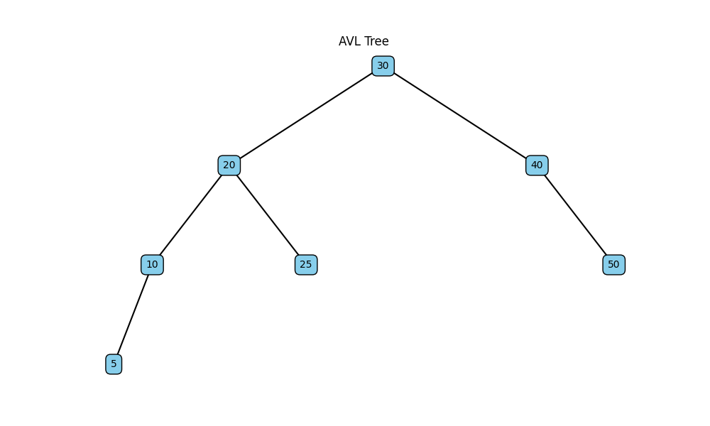

# Бінарні дерева пошуку

## Візуалізація AVL-дерева

## Завдання 1: Пошук максимального значення
Реалізовано функцію для пошуку найбільшого значення в AVL-дереві.

### Результат:

Завдання 1
Найбільше значення в AVL-дереві: 50

Завдання 2
Найменше значення в AVL-дереві: 5

Завдання 3
Сума всіх значень в AVL-дереві: 180

## Висновки:

1. AVL-дерево підтримує збалансованість, що забезпечує ефективний пошук (O(log n))
2. Реалізовані алгоритми демонструють базові операції з бінарним деревом пошуку
3. Візуалізація допомагає краще зрозуміти структуру дерева та його властивості
4. Тестові дані показують коректність роботи всіх реалізованих алгоритмів
